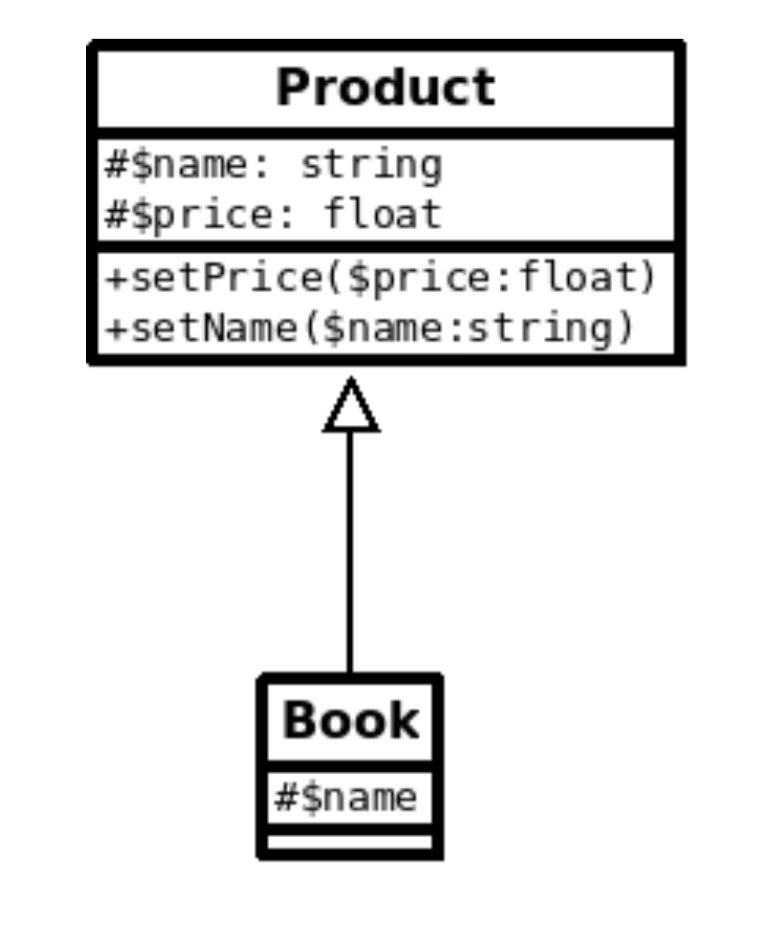

# Objet

L'objet existe depuis la version 3 de PHP, à ce moment on n'a pas vraiment un langage de programmation objet.Ce n'est qu'à partir de la version 5 que PHP introduit les véritables concepts de l'objet.Bien que PHP soit un langage de script on va programmer tout en objet dans la suite de ce cours.

## Introduction à l'objet

### Définitions

- Def Classe 

Une classe est la somme des propriétés et attributs d'un objet. 
C'est une représentation abstraite d'un objet.

- Objet 

Un objet est une instance d'une classe.

- Def Attributs et méthodes d'une classe 

Les attributs d'une classe sont les variables d'une classe et les méthodes sont les fonctions de la classe. Plus généralement on appelle membre d'une classe les attributs ou méthodes d'une classe.
Exemples Ci-dessous une représentation abstraite d'un personnage, la classe "Persona" n'est pas, par définition, concrète. 
La classe représente l'implémentation des attributs (variables de la classe) et méthodes (fonctions de la classe), le code que l'on écrit dans la classe. 

Pour rendre "concrète" son utilisation, on fera une instance de la classe Persona.

```php

class Persona{
     // les attributs de la classe, les variables de la classe
     private int $force;
     private string $secret;
     
     // n'initialiser les variables de la classe
     public function __construct(
        int $force, 
        string $secret = "my secret" // paramètre facultatif 
    ){
        $this->force = $force;
        $this->secret = $secret;
    }
}

// à partir de PHP 8
class Persona{

    public function __construct(
        private $force, 
        private $secret = "my secret"
    ){}

    public function fight(){
        echo "missile";
    }
}
``` 

Un objet est une instance de classe, c'est une variable dans le script courant.

## Visibilité d'un attribut ou d'une méthode

Si un membre de la classe est privé il est impossible d'y accéder à l'extérieur de la classe, c'est-à-dire à partir de l'objet dans le script courant.

```text

- private
+ public
# protected visibilité non accessible dans le script courant

```


     
### Exemples 

```php
<?php

class Persona{
    // les attributs de la classe, les variables de la classe
    // attention variable privée => impossible de les atteindre dans le script courant
    private int $force;
    private string $secret;
    public float $age = 100;
    
    // n'initialiser les variables de la classe
    public function __construct(
       int $force, 
       string $secret = "my secret" // paramètre facultatif 
   ){
       $this->force = $force;
       $this->secret = $secret;
   }
}

$hydra = new Persona(force: 10);
$libelle = new Persona(force: 2);
$dalinda = new Persona(force: 8);

// Un attribut 
echo $dalinda->age;

// ICI une variable publique peut muter (changer) dans le script courant (à l'exéterieur de la classe)
// Attention donc à cela car, vous ne maîtrisez plus les données qui vont être enregistrer dans l'objet
$dalinda->age = -100;

// Un attribut 
echo $dalinda->age;
```

### Méta-variable $this

Pour qu'une méthode puisse manipuler une variable de classe à l'intérieur de la classe elle-même, elle utilise la méta-variable :

```php
$this;
```

C'est une référence à une instance unique de la classe dans le script.

### Principe d'encapsulation

Si un attribut ou une méthode est privé il est donc impossible d'y accéder dans le script courant. 

Plus généralement les attributs seront privés et les méthodes publiques.

- Définition 

Les données (attributs) ne peuvent être modifiées dans le script courant directement (ils sont privés), seuls les méthodes qui contrôles les données peuvent le faire. 

Une boîte noire dans un avion par exemple aura un programme possédant des attributs privés et des méthodes publiques; pour modifier les attributs privés, si un événement exceptionnel dans l'avion se produit, seuls les méthodes publiques peuvent le faire.

- Accéder aux attributs: accesseur ou getter

- mutateur ou setter

- accesseur ou getter

### 01 Exercice Product

1. Créez une classe Product avec un name et un price. Créez deux produits :

```php
$apple = new Product(name : 'apple', price : 0.5);
$ornage = new Product(name : 'orange', price : 0.5);
```

2. Imaginez maintenant commander dans le même script 10 pommes et 5 oranges calculez la somme TTC. Ne créez pas de classe panier, faites vos calculs directement dans le script courant.


## Justification de l'utilisation des setter et getter

Ils permettent de vérifier la cohérence des données qui "hydrate" les objets (données des valeurs à vos attributs de la classe). Les variables doivent rester dans cette idée PRIVATE.

```php
// Les vitesses données à vos voitures seront comprises entre 0 et 350 uniquement, voir le setter (setSpeed) ci-dessous.
class Car{
    private float $speed;

    /**
     * Get the value of speed
     */ 
    public function getSpeed():float
    {
        return $this->speed;
    }

    /**
     * Set the value of speed
     *
     * @return  null
     */ 
    public function setSpeed(float $speed)
    {
        if($speed >= 0 && $speed < 351)
            $this->speed = $speed;

    }
}

$car = new Car;
```

## Single Responsability

Lorsqu'on programmera en objet on devra toujours garder à l'esprit le principe suivant: Une classe un rôle, ou attribuer à chaque classe une responsabilité unique définie et bornée. Par exemple la classe Persona, Scene, Role.

Il faudra également respecter le principe suivant, une classe un fichier, c'est comme cela que l'on programme en objet pas autrement.

## Exercice Calculator

Créez une classe Calculator. Cette classe implémentera les spécificités suivantes :

- addition signature : prend deux arguments numériques et retourne un flottant

- multiplication signature : prend deux arguments numériques et retourne un flottant

- division signature : prend deux arguments numériques et retourne un flottant

- somme signature : prend N un entier supérieur à 2 arguments numériques et retourne un flottant

## Exercice Calculator une autre version

Implémentez maintenant une calculatrice qui prend une expression et calcul celle-ci. L'expression ou une opération sera passée sous forme d'un tableau de tableau comme suit :

```php
$calculator = new ExpressionCalculator;

$operation = [ [11, 2], ["+"] ] ;

$calculator->result($operation);
```

Questions facultatives 

1. Ajoutez le modulo dans les opérateurs. 

2. Créez une variable de classe total pour garder le total en mémoire.

### Principe de l’héritage

Pour faire de l’héritage vous devez appliquer le principe suivant :une classe étendue doit être une sorte de ou est un.

Ainsi, par exemple si vous avez une classe Book qui est étendue de la classeProduct, vous faites bien de l’héritage, car un livre est un produit ou une sorte de produit.

Si vous n’appliquez pas ce principe vous ne faites pas d’héritage au sens strict du paradigme objet. Voici comment vous devez représenter cette relation en diagramme UML :




## Le constructeur dans l'héritage

Voyez l'exemple de code ci-dessous 

```php

class Product{
    private $name = "productName"; // non étendu
    protected $ref;

    public function __construct(string $name , string $ref = "00000" )
    {
        $this->name = $name;
        $this->ref = $ref;
    }
}

class Book extends Product{
    protected $ref = "b0001"; // redéfinir 

    // surcharge du constructeur 
    public function __construct(string $name , string $ref = "00000" )
    {   
        // On appelle le constructeur dans la classe mère pour lui passer des valeurs
        parent::__construct(name : $name, ref: $ref); 
    }

    public function info(){
        var_dump($this->ref);
        //var_dump($this->name); // impossible on n'y a pas accès car private 
    }
}

// SI VOUS NE REDEFINISSEZ PAS LE CONSTRUCTEUR vous êtes obligé de lui passer des valeurs sachant que ce dernier est définie dans la classe mère
$book = new Book(name : "La route", ref: "b0001");

var_dump($book);
```

### 01 Exercice Square

Définissez un Rectangle et une classe Square, cette dernière classe hérite de la classe Rectangle. La méthode perimeter est définie (implémentée) dans la classe Rectangle.

Cette méthode permet de calculer le périmètre d'un carré ou d'un rectangle. Essayez de factoriser les plus possibles les attributs et méthodes dans la classe mère.

```php

$square = new Square( ... ) ; // définissez les valeurs de votre carré à l'instanciation de ce dernier.

$square->perimeter();

```

### Correction

Remarques : attention au hard coding, ce sont des valeurs qui sont écrites directement elles ne peuvent pas être facilement changées à moins de changer le code de la classe. Passez par des constantes de classe ou variables de classe pour les définir.

```php
class Rectangle{
    // ... DU CODE AVANT

    public function perimeter(): float
    {

        // HARD CODING pour la précision faites au moins une variable de classe ou une constante
        // return round(2 * ($this->w + $this->h), 2);

        return round(2 * ($this->w + $this->h), self::PRECISION);
    }
}
```

### 02 Exercice Cart

Créez une classe Product et une classe Bike qui hérite de Product. La classe Bike possèdera les spécialisations suivantes :

- Une méthode définissant le type de vélo.

- Une méthode permettant de définir un numéro unique identifiant le vélo.

- Commander 5 produits et appliquez une promo de 10% sur l'ensemble des produits commandés. Chaque produit est défini avec son nom et prix en HT.

*Vous devez organiser cet exercice dans un dossier Shop dans lequel vous créez vos deux classes ainsi qu'un fichier app.php permettant de faire les scripts pour tester la logique métier. Pensez dans cet objectif à importer correctement vos classes uniquement dans le fichier app.php.*

## Introduction  Autoloader 

Un autoloader permet d'auto-charger des classes. la fonctionn spl_autoload_register s'exécutera lorsque PHP ne trouvera pas la définition de la classe dans le fichier. Vous pouvez l'utiliser pour définir votre auto-loader, respectez la convention classique pour les applications PHP : un fichier par classe et le fichier porte le nom de la classe.

```php
spl_autoload_register(function($className){

    // le nom de la classe = au nom du fichier
    require_once $className . '.php' ;
});

$bike = new Bike('brompton', 1500);
```

1. C'est évidement plus portable (moins de complication pour gérer les dépendances).

2. On gagne en optimisation d'exécution, car seulement ce qui est nécessaire à l'application sera inclu par votre auto-loader.

Remarque : Symfony, Laravel etc utilisent un auto-loader PSR (PHP Standard Recomandation)


### Exercice le plus grand et nombres spécifiques

Créez une classe SearchNumber. Organisez l'exercice avec un auto-loader, même si ici vous n'avez qu'une seule classe. Placez la classe SearchNumber dans un dossier src. Et créez le fichier app.php à la racine du projet.

```text
Search/
    src/
        SearchNumber.php
    app.php
```

1. Créez une méthode permettant d'ajouter une liste de nombre(s) dans votre classe.

2. Créez une méthode biggest elle retournera le nombre le plus grand de la liste ajoutée dans votre classe ou une exception.

3. Créez la méthode parity, elle possède un argument et retourne tous les nombres ayant la parité précisé par l'argument.

```php
// Dans le fichier app.php

// ...

$search->biggest();
$search->parity(2); // retourne tous les nombres pairs dans une liste
$search->parity(7); // retourne tous les nombres multiple de 7 dans une liste

```

## traits

C'est une méthode pour réutiliser du code en PHP dans le contexte de l'héritage simple. Une classe peut utiliser plusieurs traits.

Un trait sert à regrouper des fonctionnalités intéressantes, il ne peut pas être instancié. Il s'ajoute à la notion d'héritage qui autorise la composition horizontale des comportements, ou plus exactement l'utilisation de méthodes sans héritage.

```php
trait showHello {
    function hello() { echo "Hello " ; }
}

trait showWorld {
    function world() { echo " World " ; }
}

class View{
    use showHello, showWorld;

    public function exclamation(){
        echo " !";
    }
}

$o = new View();
$o->hello();
$o->word();
$o->exclamation();
// Hello World !
```

### Résolution de conflits

Deux traits identiques dans une même classe lève une erreure fatale. Pour résoudre un conflit entre deux traits il faut utiliser l'opérateur **insteadof**.

```php
trait A {
    public function smallTalk() {
        echo 'a';
    }
    public function bigTalk() {
        echo 'A';
    }
}

trait B {
    public function smallTalk() {
        echo 'b';
    }
    public function bigTalk() {
        echo 'B';
    }
}

class Talker {
    use A, B {
        B::smallTalk insteadof A;
        A::bigTalk insteadof B;
    }
}
``` 

### Changer la visibilité des méthodes 

En utilisant la syntaxe as, vous pouvez aussi ajuster la visibilité de la méthode dans la classe qui l'utilise. Les méthodes privée ne peuvent être modifiées. Une classe peut implémenter plusieurs interfaces.

```php 
trait HelloWorld {
    protected function sayHello() {
        echo 'Hello World!';
    }
}

// Modification de la visibilité de la méthode sayHello protected => public possible
class A {
    use HelloWorld { sayHello as public; }
}

$b = new A;

echo $b->sayHello();

```

## Héritage 

L’héritage permet de factoriser un ensemble de méthodes et d’attributs dans une classe mère que des classes filles peuvent partager.

Les classes filles seront spécialisées par rapport à la classe mère. Par exemple une classe Product mère et une classe Stylo fille, la classe Stylo est dite spécialisée par rapport à la classe Product. La classe Stylo possédera plus de spécificités que la classe Product.

La relation de dépendance entre une classe mère et une classe fille est très forte. On parlera de couplage fort. En effet, pour instancier la classe étendue il faut que la classe mère soit définie dans le script courant.

L’héritage multiple n’existe pas en PHP, vous ne pouvez hériter que d’une seule classe à la fois.


## Interface (rappel)

Les interfaces objet vous permettent de définir des méthodes publiques que vos classes devront implémentées.

```php
interface iTemplate
{
    public function setVariable($name, $var);
    public function getHtml($template);
}
class Template implements iTemplate
{
    private $vars = array();

    public function setVariable($name, $var)
    {
        $this->vars[$name] = $var;
    }

    public function getHtml($template)
    {
        foreach($this->vars as $name => $value) {
            $template = str_replace('{' . $name . '}', $value, $template);
        }

        return $template;
    }
}
```

## TP Yam 

Vous allez créer un petit composant qui permet de lancer 5 dés pour jouer au Yam. Il n'y aura qu'un seul joueur dans l'application et nous testerons que le lancer de 5 dés (en même temps). Nous allons faire des statistiques sur les différentes combinaisons du jeu. Vous ne testerez que certaines combinaisons de Yam.

Pour compter le nombre de combinaisons vous lancerez plusieurs les 5 dés. Par exemple sur 50 tests qui lance 1 fois 5 dés en même temps on a trouvé :

- Brelan : 2 (trois dés identiques)

- Carré : 1 (4 dés indentiques)

- Double paire : 4 (deux dés identiques X 2 les paires sont des dés différents )

- Yam : 2 (5 dés identiques)

Créez autant de classe que nécessaire pour implémenter ce composant.

## TP Queue

Implémentez une Queue en définissant une classe. Voici comment dans le script courant vous devez appeler votre code pour ajouter un élément dans la queue et récupérer le premier élément de la queue.

FIFO (firts In first out)

```php
$queue = new Queue();
$queue->push(1);
$queue->push(2);
$queue->push(3);
$queue->pop(); // affiche 1
$queue->clear(); // retire tous les éléments de la queue
```

Facultatif. Votre Queue peut implémenter l'interface ArrayAccess.

```php
class Obj implements ArrayAccess {

    public function __construct(
        private array $container = [
             "un"    => 1,
            "deux"  => 2,
            "trois" => 3,
        ]
    ) {}

    public function offsetSet($offset, $value) {
        if (is_null($offset)) {
            $this->container[] = $value;
        } else {
            $this->container[$offset] = $value;
        }
    }

    public function offsetExists($offset) {
        return isset($this->container[$offset]);
    }

    public function offsetUnset($offset) {
        unset($this->container[$offset]);
    }

    public function offsetGet($offset) {
        return isset($this->container[$offset]) ? $this->container[$offset] : null;
    }
}

$obj = new Obj;

var_dump($obj["deux"] ?? 'no exist'); // méthode offsetExists dans la classe
unset($obj["deux"]); // supprime l'élément  // méthode offsetUnset exécutée
var_dump(?? $obj["deux"] 'no exist');
$obj["deux"] = "Une valeur";
var_dump($obj["deux"]);
$obj[] = 'Ajout 1';
$obj[] = 'Ajout 2';
$obj[] = 'Ajout 3';
print_r($obj);
```

## TP Exercice Button & Lamp

Imaginez une lampe dans votre salon. Décomposez celle-ci en deux entités : un Button et une Lamp. Vous ferez également un schéma sur papier pour vous représenter les relations entre ces deux entités (facultatif).

```php
$lamp= new Button(new Lamp);
```

Puis implémentez le déclenchement lumière alumé/éteint.

```php
echo $lamp->switchDevice(); // turn on
echo $lamp->switchDevice(); // turn off
echo $lamp->switchDevice(); // turn on
echo $lamp->switchDevice(); // turn off
```

## TP exercices Letter & Console

Créez deux classes Letter et Console. La première classe génère les lettres de l'alphabet et la deuxième affiche le contenu d'un tableau de dimension 1 dans le terminal.

La méthode generate de la classe Letter génère 10 lettres aléatoirement de l'alphabet et retourne ces lettres dans un tableau. La show affiche en console le résultat.

```php
$letter = new Letter();
$console = new Console();

$alphabet = $letter->generate(10);

$console->show($alphabet);
```
