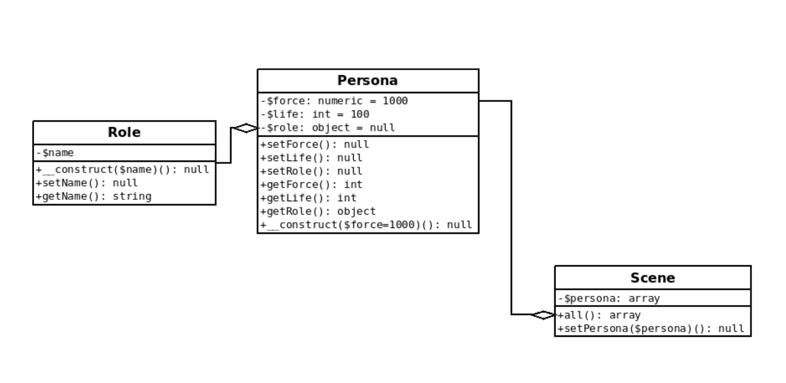

# 02 TP

## Organisation fichiers et dossiers

```text
Game/
    src/
        Role.php
        Persona.php
        Scene.php
app.php
```

On va créer trois classes. La première "Persona" permet de créer des personnages de jeu avec de la
force, un niveau de vie et un rôle, la classe Role définira ce rôle. 
La classe Scene possède une unique méthode setPersona pour ajouter des objets de type Persona dans un tableau.

Pour créer ces classes on va suivre le schéma UML suivant, un schéma UML permet de voir
entièrement les classes à implémenter et de préciser également les relations entre les classes. Ici
nous avons deux relations l'attribut "role" dans la classe Persona enregistre un objet de type Role et
la classe Scene enregistres des objets de type Persona dans un tableau. Pour tester tout cela on va
inclure toutes les classes dans le fichier app.php et instancier les classes (voir après la figure).

Erratum : setRole ajoute un role à la classe Persona.



## Dans le fichier app.php

```php
// définition d'un rôle
$savior = new Role();
$savior->setName('savior');
// création d'un personnage et ajout d'un rôle, on ajoute bien un objet dans un autre !
$mario = new Persona;
$mario->setRole($savior);

// ... à continuer avec la scene
```